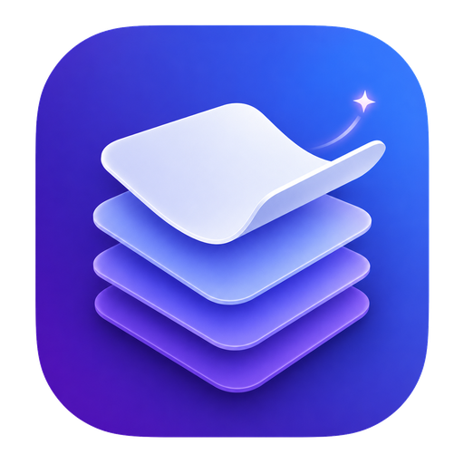
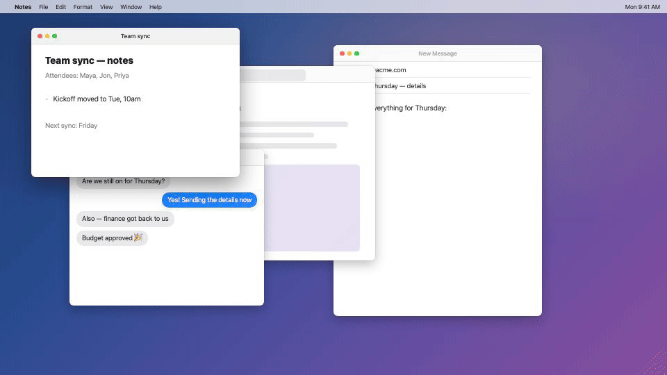

<p align="center">
  
</p>

# Stacked

An open-source macOS paste stack: copy a bunch of things, then paste them out
one by one, in order, anywhere.

Inspired by [Paste's Paste Stack](https://pasteapp.io/help/using-paste-stack)
feature. Stacked is an independent open-source project and is not affiliated
with Paste.



## How it works

1. Press **⇧⌘C** to start a stack. A floating panel appears.
2. Copy things — from any app. Every copy queues up in the panel, in order.
3. Press **⌘V** wherever you want the content. Each paste emits the next item
   in the stack and removes it from the panel.
4. Click the **arrows button** to reverse the paste direction
   (first-copied-first ⇄ last-copied-first).
5. Right-click an item (or swipe left with two fingers) to **delete** it.
6. Press **⇧⌘C** again to dismiss the stack. The stack is cleared — it's an
   ad-hoc pinboard, not a clipboard history.

Great for assembling a document from many scattered pieces: collect everything
first, then paste it out in sequence.

## Install

**The easy way** — open Terminal (⌘-Space, type "Terminal", press Return),
paste this line, press Return:

```sh
curl -fsSL https://raw.githubusercontent.com/sharnobyl/stacked/main/install.sh | bash
```

Done. Stacked downloads, installs itself into Applications, and launches.

**With Homebrew:**

```sh
brew install --cask --no-quarantine sharnobyl/tap/stacked
```

**Manually:** download `Stacked-vX.Y.Z.zip` from the
[latest release](../../releases/latest), unzip, drag `Stacked.app` to
Applications, then right-click it → **Open** → **Open** (needed once because
the app is not notarized).

Requires macOS 13 or later.

## Permissions

Stacked asks for **Accessibility** permission (System Settings → Privacy &
Security → Accessibility). It needs this for one thing only: noticing when you
press ⌘V so it can hand the next stack item to the app you're pasting into.

Without the permission, Stacked still works in a manual mode: click an item in
the panel to load it onto the clipboard (and remove it from the stack), then
paste normally.

Stacked is fully offline. Nothing is stored on disk or sent anywhere; the
stack lives in memory and is cleared when you dismiss it or quit.

## Build from source

```sh
git clone https://github.com/sharnobyl/stacked.git
cd stacked
./Scripts/bundle.sh          # produces build/Stacked.app
open build/Stacked.app
```

Run the tests with `swift test`. No third-party dependencies.

## License

[MIT](LICENSE)
